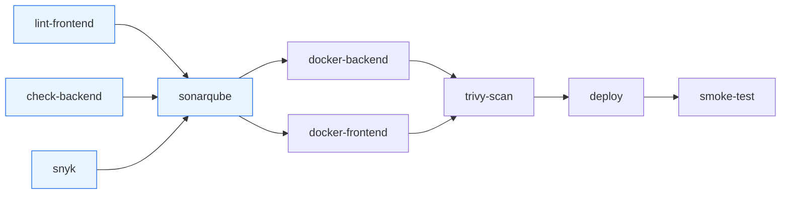

# Red Store — Shoe E-Commerce Platform

[](https://github.com/benmassaoudlazher789-creator/APP-E-Commerce/actions/workflows/ci-cd.yml)

Red Store is a full-stack **MERN** e-commerce platform for selling shoes. It features a Men / Women / Kids catalog with filters, live search, a wishlist, a per-user persistent cart, a multi-step checkout with **Stripe** payments, and an **admin dashboard** for managing products and orders.


---

## Table of Contents

- [Tech Stack](#tech-stack)
- [Features](#features)
- [Project Structure](#project-structure)
- [Installation & Setup](#installation--setup)
- [Tests](#tests)
- [CI/CD](#cicd)
- [Useful Scripts](#useful-scripts)
- [Screenshots](#screenshots)
- [Author](#author)

---

## Tech Stack

### Frontend (`frontend/`)

| Category | Libraries |
|---|---|
| Core | React 19, Vite 8, React Router 7 |
| State management | Redux 5 + Redux Thunk (classic `createStore`, not Redux Toolkit), React Redux |
| UI | Ant Design 6, React-Bootstrap / Bootstrap 5, Tailwind CSS 3, Lucide icons |
| Animation | Framer Motion |
| Payments | Stripe.js + React Stripe.js (Card Element) |
| Misc | Axios, React Hot Toast |

### Backend (`backend/`)

| Category | Libraries |
|---|---|
| Server | Node.js, Express 5 |
| Database | MongoDB with Mongoose 9 |
| Auth & security | JSON Web Tokens (`jsonwebtoken`), `bcrypt`, `express-validator`, `express-rate-limit` |
| Payments | Stripe (Payment Intents) |
| Media | Multer (uploads) + Cloudinary (image hosting) |
| AI | Anthropic SDK (`@anthropic-ai/sdk`) for product description generation |

---

## Features

- **JWT authentication with roles**: register / login, a `client` role by default and a single `admin` role, route guards on both the API (`isAuth` + `isRole`) and the UI. Login is rate-limited, and there is a password reset flow via a hashed one-time token.
- **Product catalog** split into Men / Women / Kids, with filters for **brand**, **size** and **max price**, sorting, and dedicated *New Arrivals* and *Sale* pages.
- **Live search** in the navbar, with debounced, cancellable requests to a server-side search endpoint (title, description, category, brand).
- **Wishlist** stored per user in MongoDB.
- **Persistent cart per user**, stored in MongoDB (`carts` collection) so it survives logout/login and syncs across devices. Stock is validated server-side on every change.
- **Multi-step checkout** (Shipping → Payment → Review) with **Stripe** Payment Intents.
- **User profile** with personal info, saved addresses and order history.
- **Admin dashboard** (`/dashboard/admin`):
  - Overview: total orders, products, users and revenue, plus recent orders with inline status updates.
  - Products (`/dashboard/admin/products`): paginated table with search, edit (price, category, sizes/stock) and delete with confirmation.
  - Add-product form with image uploads to Cloudinary (`/admin/products`).
- **AI-assisted product descriptions**: an admin-only endpoint (`POST /api/product/generate-description`) generates a product description with Anthropic's Claude API.

---

## Project Structure

The repository contains **two independent npm projects**. There is no root `package.json`.

```
.
├── backend/
│   ├── server.js          # Express entry point: CORS, JSON, DB connection, route mounting
│   ├── config/            # MongoDB connection (with DNS fallback + retries)
│   ├── controller/        # Request handlers: auth, product, cart, order, payment, admin
│   ├── middlewares/       # isAuth (JWT), isRole (RBAC), optionalAuth, express-validator chains
│   ├── model/             # Mongoose schemas: User, Product, Cart, Order, PaymentIntent
│   ├── routes/            # Routers mounted under /api/auth, /product, /cart, /order, /payment, /admin
│   ├── scripts/           # One-off / seed scripts for the database (see below)
│   └── util/              # Cloudinary, Multer and Anthropic client helpers
│
└── frontend/
    ├── vite.config.js     # Vite config (dev proxy /api -> backend)
    └── src/
        ├── main.jsx       # App bootstrap: Router, Redux Provider, Ant Design theme
        ├── App.jsx        # Route table
        ├── pages/         # Route-level pages (Shop, ProductDetail, Cart, Checkout, Profile, ...)
        │   ├── checkout/  # Checkout steps: Shipping, Payment (Stripe), Review
        │   └── dashboard/ # Admin dashboard: overview + product management
        ├── components/    # Shared UI (navbar, footer, product cards, home sections, profile widgets)
        ├── JS/            # Redux layer: actions/, actionsType/, reducers/, store/
        ├── styles/        # Theme tokens, shared CSS, Ant Design theme
        └── utils/         # API helpers, formatting, validators
```

---

## Installation & Setup

### Prerequisites

- Node.js 20.19+ (or 22.12+) and npm (required by Vite 8)
- A MongoDB database (e.g. MongoDB Atlas)
- A Cloudinary account (image uploads)
- A Stripe account in test mode (payments)
- An Anthropic API key (optional, only needed for AI description generation)

### 1. Clone the repository

```bash
git clone https://github.com/benmassaoudlazher789-creator/APP-E-Commerce.git
cd APP-E-Commerce
```

### 2. Backend

```bash
cd backend
npm install
cp .env.example .env   # then fill in your own values
```

Environment variables (`backend/.env`, see `backend/.env.example`):

| Variable | Description |
|---|---|
| `PORT` | API port (the frontend expects `1980` by default) |
| `MONGODB_URI` | MongoDB connection string |
| `SECRET_KEY` | Secret used to sign JWTs |
| `CLOUD_NAME` | Cloudinary cloud name |
| `API_KEY` | Cloudinary API key |
| `API_SECRET` | Cloudinary API secret |
| `STRIPE_SECRET_KEY` | Stripe secret key (`sk_test_...`) |
| `ANTHROPIC_API_KEY` | Anthropic API key (AI product descriptions) |
| `FRONTEND_URL` | *(optional)* Base URL used in password-reset links. Defaults to `http://localhost:5173` |

> **Note:** `.env` files are git-ignored. Never commit real credentials.

### 3. Frontend

```bash
cd frontend
npm install
```

Create `frontend/.env`:

| Variable | Description |
|---|---|
| `VITE_API_URL` | Backend base URL, e.g. `http://localhost:1980` |
| `VITE_STRIPE_PUBLISHABLE_KEY` | Stripe publishable key (`pk_test_...`) |

### 4. Run in development

Open two terminals:

```bash
# Terminal 1: API (node --watch, auto-restart)
cd backend
npm run dev
```

```bash
# Terminal 2: React app (Vite)
cd frontend
npm run dev
```

The app runs at `http://localhost:5173` and the API at `http://localhost:<PORT>`.

### 5. (Optional) Seed data and create an admin

```bash
cd backend
npm run seed:products                            # insert the product catalog
npm run seed:sale                                # mark a selection of products as on sale
node scripts/setUserRole.js you@example.com admin  # promote your account to admin
```

### Available npm scripts

| Location | Command | Description |
|---|---|---|
| `backend/` | `npm run dev` | Start the API with `node --watch` (auto-restart) |
| `backend/` | `npm start` | Start the API with node |
| `backend/` | `npm run seed:products` | Seed the product catalog |
| `backend/` | `npm run seed:sale` | Flag selected products as on sale |
| `backend/` | `npm test` | Run the Jest test suite (see [Tests](#tests)) |
| `backend/` | `npm run test:coverage` | Run the tests with a coverage report in `backend/coverage/` |
| `frontend/` | `npm run dev` | Start the Vite dev server |
| `frontend/` | `npm run build` | Production build |
| `frontend/` | `npm run preview` | Preview the production build |
| `frontend/` | `npm run lint` | Run ESLint |

---

## Docker

The app ships as two images: `lazher789/redstore-backend` (Express API) and `lazher789/redstore-frontend` (Nginx serving the Vite build and proxying `/api/*` to the backend). Only Nginx is exposed, at **http://localhost:8080**.

### Prerequisites

- Docker Desktop (Compose v2)
- `backend/.env` filled in (see `backend/.env.example`). `PORT` is forced to `1980` by Compose.
- A root `.env` copied from `.env.example`, holding **public** build values only (`VITE_STRIPE_PUBLISHABLE_KEY=pk_test_...`). Never put a secret here: it ends up in the JS bundle.

### Run with MongoDB Atlas (default)

```bash
docker compose up --build        # add -d to run in the background
```

### Run offline with a local MongoDB

```bash
docker compose -f docker-compose.yml -f docker-compose.local.yml up --build
```

This adds a `mongo:7` container (data kept in the `mongo-data` volume) and points the backend's `MONGODB_URI` at it.

### Seed the database

```bash
docker compose exec backend npm run seed:products
docker compose exec backend npm run seed:sale
docker compose exec backend node scripts/setUserRole.js you@example.com admin
```

(With the local Mongo override, add `-f docker-compose.yml -f docker-compose.local.yml` after `docker compose`.)

### Logs, status, stop

```bash
docker compose ps                  # container status
docker compose logs -f backend     # follow backend logs (frontend: Nginx logs)
docker compose down                # stop and remove containers + network, KEEP volumes (local Mongo data survives)
docker compose down -v             # same, and ALSO delete named volumes (wipes the local mongo-data database)
```

### Environment variables specific to Docker

| Where | Variable | Description |
|---|---|---|
| frontend container | `BACKEND_URL` | Where Nginx proxies `/api/*`: scheme + host (+ port), **no trailing slash**. Local: `http://backend:1980`, Render: `https://xxx.onrender.com` |
| backend | `TRUST_PROXY` | Number of proxies in front of Express (default `1` = Nginx). Needed for correct client IPs in the login rate limiter |
| frontend build arg | `VITE_API_URL` | Leave empty: the app calls `/api` relative to its own origin |

---

## Tests

The backend has an automated test suite built with **Jest** and **Supertest**, in [`backend/tests/`](backend/tests).

```bash
cd backend
npm test                 # run all tests
npm run test:coverage    # same, plus a coverage report (backend/coverage/, lcov + summary)
```

- **No external services.** The tests run against an in-memory MongoDB ([mongodb-memory-server](https://github.com/typegoose/mongodb-memory-server)), never Atlas. Cloudinary, Stripe and the Anthropic SDK are mocked, so nothing goes over the network. The only download is the `mongod` binary, fetched once on the first `npm install` and then cached.
- **No real secrets.** `backend/.env` is never loaded during tests (`dotenv` is only called in `server.js`). [`tests/setup/env.js`](backend/tests/setup/env.js) sets fake values (`SECRET_KEY`, Stripe/Cloudinary/Anthropic keys).
- **Isolation.** Every test file gets its own database, which is emptied after each test ([`tests/setup/db.js`](backend/tests/setup/db.js)).
- **App / server split.** `app.js` builds and exports the Express app (routes and middleware). `server.js` loads `.env`, connects to MongoDB and calls `listen`. Supertest imports `app.js` directly.

| File | What it covers |
|---|---|
| `health.test.js` | `GET /api/health` → 200, `db: "up"`, `no-store`, no sensitive fields |
| `product.test.js` | `GET /api/product/allProd` (empty list, data, filters, limit), `GET /api/product/prod/:id` |
| `auth.test.js` | Register (201 + token, hashed password, duplicate email, validation), login (success, wrong password, unknown email), `/current`. Checks that no password is ever returned |
| `protection.test.js` | `isAuth`: no token (403), invalid/forged token (401), deleted user (404). `isRole("admin")`: non-admin users get 403 on admin and product write routes, and admins get access |

In CI, the `check-backend` job runs `npm run test:coverage`. It caches the `mongod` binary (key: the `mongodb-memory-server` version) and uploads `lcov.info` as an artifact. The `sonarqube` job reads that file through `sonar.javascript.lcov.reportPaths`.

---

## CI/CD

A GitHub Actions pipeline ([`.github/workflows/ci-cd.yml`](.github/workflows/ci-cd.yml)) runs on every push and pull request to `main`. A newer push on the same branch cancels the run still in progress. All jobs run on `ubuntu-24.04`, and every third-party action is pinned to a commit SHA (version in a comment).



Blue jobs run on pushes **and** pull requests; the others run on pushes to `main` only.

| Job | Runs on | What it does |
|---|---|---|
| `lint-frontend` | push + pull request | Node 22 (npm cache): `npm ci`, `npm run lint`, `npm run build` in `frontend/` |
| `check-backend` | push + pull request | Node 22 (npm cache + cached `mongod` binary): `npm ci`, `npm run test:coverage` (Jest, in-memory MongoDB, `lcov.info` uploaded as the `backend-coverage` artifact), `node --check` on every `.js` file, then loads every config/util/model/middleware/controller/route module (no database needed) |
| `snyk` | push + pull request | Snyk scan of the `backend/` and `frontend/` npm dependencies, fails on `high` or above. Skipped with a notice if `SNYK_TOKEN` isn't set |
| `sonarqube` | push + pull request, after the 3 jobs above | SonarQube Cloud analysis of `backend/` and `frontend/src`, with backend test coverage from the `backend-coverage` artifact (config in [`sonar-project.properties`](sonar-project.properties)). Skipped with a notice if `SONAR_TOKEN` isn't set |
| `docker-backend` | push only, after `sonarqube` | Builds and pushes `lazher789/redstore-backend`, tagged with the **short commit SHA only**, with `APP_VERSION=<short SHA>` as build arg (returned by `/api/health`). GitHub Actions Buildx cache (`redstore-backend` scope) |
| `docker-frontend` | push only, after `sonarqube` | Same for `lazher789/redstore-frontend`, with the `VITE_STRIPE_PUBLISHABLE_KEY` build arg (`redstore-frontend` cache scope) |
| `trivy-scan` | push only, after both image jobs | Trivy scans both SHA-tagged images. The HIGH + CRITICAL report is published in the job summary; the job fails on any **fixable CRITICAL** vulnerability |
| `deploy` | push only, after `trivy-scan` | Adds the `latest` tag to both scanned images with `docker buildx imagetools create` (no rebuild), then calls the Render Deploy Hooks. If a hook secret isn't set yet, the job prints a notice and still succeeds |
| `smoke-test` | push only, after `deploy` | Checks the live Render deployment through the frontend URL (see [Health check & smoke test](#health-check--smoke-test)). Skipped with a notice if a Render hook secret isn't set |

`latest` is only moved once the images have passed the Trivy scan.

### Required GitHub secrets

Set them in **Settings → Secrets and variables → Actions → New repository secret**:

| Secret | Used by |
|---|---|
| `SNYK_TOKEN` | `snyk` (optional: the scan is skipped without it) |
| `SONAR_TOKEN` | `sonarqube` (optional: the analysis is skipped without it) |
| `DOCKERHUB_USERNAME` | `docker-backend`, `docker-frontend`, `trivy-scan`, `deploy` |
| `DOCKERHUB_TOKEN` | same jobs (Docker Hub access token, Read & Write) |
| `VITE_STRIPE_PUBLISHABLE_KEY` | `docker-frontend` (frontend build arg, public `pk_...` key) |
| `RENDER_DEPLOY_HOOK_BACKEND` | `deploy`, `smoke-test` (optional until Render is set up) |
| `RENDER_DEPLOY_HOOK_FRONTEND` | `deploy`, `smoke-test` (optional until Render is set up) |

Before enabling SonarQube Cloud, replace the `sonar.organization` and `sonar.projectKey` placeholders in `sonar-project.properties`.

### Health check & smoke test

The backend exposes a public `GET /api/health` endpoint (no authentication, no rate limit, never cached):

```json
{ "status": "ok", "db": "up", "version": "a1b2c3d", "uptime": 1234, "timestamp": "2026-10-09T12:00:00.000Z" }
```

- `db` is `"up"` when the Mongoose connection is open (`readyState === 1`), `"down"` otherwise
- `version` comes from the `APP_VERSION` env var (`"dev"` by default, the short commit SHA in images built by the CI)
- HTTP `200` when the database is up, `503` otherwise (`status: "error"`)

It is reachable directly on the backend and through the frontend Nginx proxy (`/api/*`). The backend image declares a Docker `HEALTHCHECK` that calls it with `node` on `$PORT` (curl isn't available on Alpine), visible with `docker compose ps`.

After `deploy`, the `smoke-test` job:

1. polls `https://redstore-frontend-tmxu.onrender.com/api/health` every 15 s, for up to 8 minutes (free Render services sleep and wake up slowly), until `version` equals the commit's short SHA and `db` is `"up"`
2. then checks that `/` and `/cart` (SPA fallback) answer `200` with HTML, and `/api/product/allProd` answers `200` with JSON
3. fails with an explicit error annotation if a check fails, and writes a results table in the job summary

> Render ignores the Docker `HEALTHCHECK`: set **Health Check Path** to `/api/health` in the backend service settings so Render uses it too. Don't define `APP_VERSION` in the Render dashboard, or it will override the version baked into the image and the smoke test will never match.

---

## Useful Scripts

Located in `backend/scripts/` and run from the `backend/` folder:

- **`seedRealProducts.js`**: seeds the Red Store shoe catalog (Men / Women / Kids). It is idempotent, so re-running it never creates duplicates (`npm run seed:products`).
- **`setUserRole.js`**: changes a user's role by email, e.g. to promote an account to `admin` (`node scripts/setUserRole.js <email> <role>`).
- **`markProductsOnSale.js`**: marks a selection of products as on sale, with an original price and a discount percentage, to populate the *Sale* page (`npm run seed:sale`).

The other files in this folder are one-off data-maintenance scripts (image and category fixes).

---

## Screenshots

> _Screenshots coming soon._

<!--
| Home | Shop |
|---|---|
|  |  |

| Checkout | Admin Dashboard |
|---|---|
|  |  |
-->

---

## Author

**Lazher Ben Massaoud**

- GitHub: [@benmassaoudlazher789-creator](https://github.com/benmassaoudlazher789-creator)
- LinkedIn: [Lazher Ben Massaoud](https://www.linkedin.com/in/ben-massaoud-lazher/) <!-- TODO: replace with your LinkedIn URL -->
